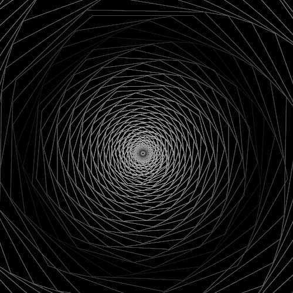

# Art With Rust

Art and random ideas created using [valora](https://docs.rs/valora/0.2.12/valora/index.html).

## Usage

If you want to see any of the codes in the table below you can run them using:

```rust
cargo run --example <example>
```

| cycloid               | polyrotate               |
| --------------------- | ------------------------ |
|  |  |

| spirograph               | trochoidal               |
| ------------------------ | ------------------------ |
|  |  |
